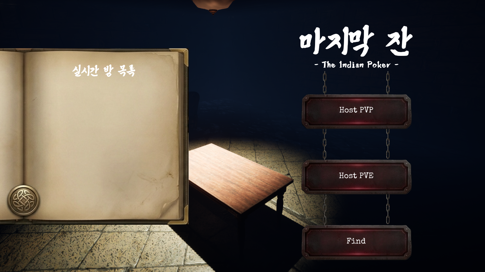
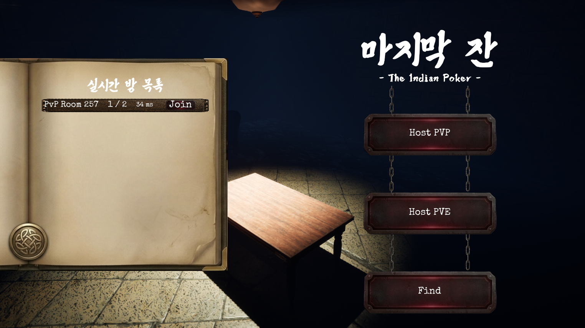
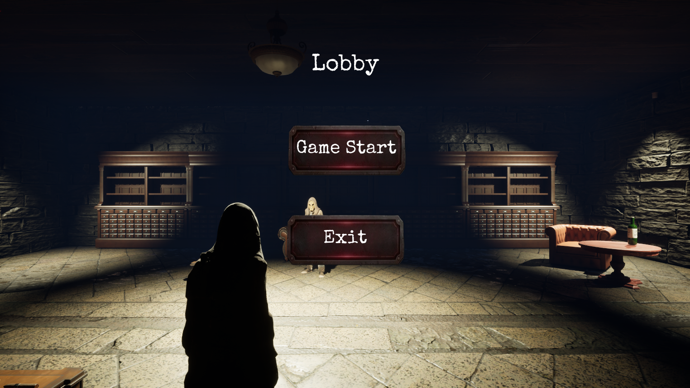
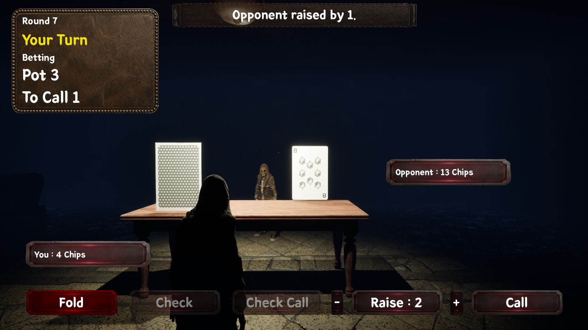
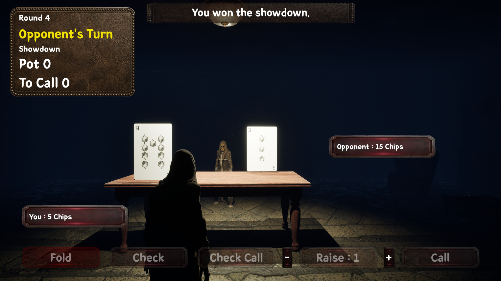
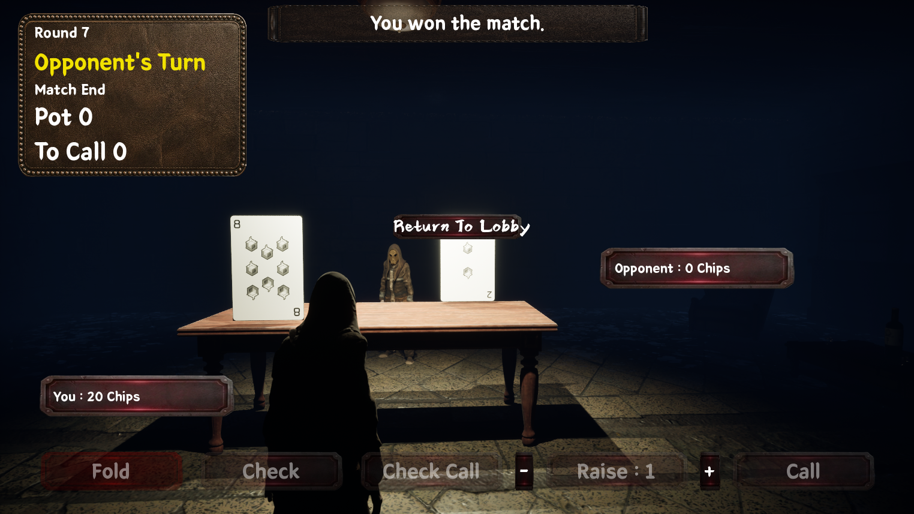
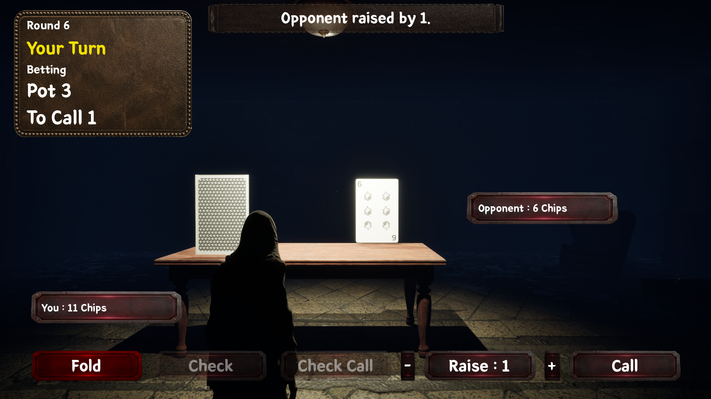

# Indian Poker Multiplay Game (UE5)

Unreal Engine 5 기반의 1:1 인디언 포커 멀티플레이 프로젝트입니다.  
Listen Server 기반 PvP / PvE 모드를 지원합니다.

 

## 프로젝트 개요

- **장르** : 카드 게임 / 심리전 / 멀티플레이
- **엔진** : Unreal Engine 5
- **개발 방식** : C++ & Blueprint
- **플레이 모드**
  - PvP (Host / Find / Join)
  - PvE (Bot 상대)

 

## 프로젝트 소개

이 프로젝트는 1:1 심리전 카드 게임 인디언 포커를 구현한 게임입니다. 
단순히 인디언 포커 규칙만 구현하는 것이 아니라,  
Unreal Engine 5 환경에서 Listen Server 기반 멀티플레이 흐름을 처음부터 끝까지 직접 구축하는 것을 목표로 제작했습니다.

세션 생성, 탐색, 참가, 로비 대기, 게임 시작, 쇼다운, 경기 종료, 로비 복귀, 이탈 처리까지  
실제 멀티플레이 게임에서 필요한 전체 루프를 하나의 프로젝트 안에 담고자 했습니다.

또한 인디언 포커의 핵심 재미인 심리전과 카운팅 구조를 살리기 위해  
서버 권위 기반의 베팅 처리, 카드 공개, 덱 소모 및 재셔플 타이밍을 정리했고,  
PvP뿐 아니라 PvE까지 지원해 하나의 완성된 플레이 흐름을 만들고자 했습니다.

 

## 프로젝트 목표

- UE5에서 서버 권위(Server-Authoritative) 멀티플레이 구조를 직접 구현해보기
- 세션 생성 / 탐색 / 참가 / 로비 / 게임 시작까지 이어지는 실제 멀티플레이 흐름 만들기
- 인디언 포커의 룰을 **Deal → Betting → Showdown → RoundResult → MatchEnd** 구조로 정리하기
- PvP뿐 아니라 **PvE Bot 모드**까지 포함한 플레이 가능한 빌드 만들기
- Host / Client 이탈과 재접속까지 고려한 **안정적인 멀티플레이 루프** 구축하기

 

## 주요 기능

- Listen Server 기반 LAN 세션 생성 / 탐색 / 참가
- PvP / PvE 모드 지원
- MainMenu → Lobby → Game → MatchEnd → Return to Lobby 전체 흐름 구현
- 서버 권위 기반 베팅 액션 처리
  - Check / Call / Raise / Fold
- Showdown 및 승패 처리
- 20장 덱 기반 카드 소모 및 셔플 구조
- Host / Client 이탈 처리
- Return to Lobby 및 재접속 흐름 지원
- 맵 / UI / 사운드 / Idle 포즈까지 포함한 최종 연출 적용

 

## 스크린샷

### MainMenu
프로젝트의 세계관과 UI 테마를 동시에 보여주는 시작 화면입니다.

 

### Find Session
세션 탐색 후 방 목록을 확인하고, 원하는 방에 참가할 수 있습니다.

 

### Lobby
결투실 옆 위스키 라운지 컨셉의 대기 공간입니다.  
Host는 여기서 게임을 시작할 수 있고, 두 플레이어는 실제 게임 전 대기 상태를 공유합니다.

 

### In-Game HUD
게임 진행 중 Pot, To Call, Turn, Chips, Last Action 등 액션 버튼과 
칩 개수, pot 등 인게임 핵심 정보를 확인할 수 있습니다.

 

### Showdown
베팅이 종료되면 양쪽 카드가 공개되고, 승패와 칩 이동이 처리됩니다.

 

### Match End
게임 종료 후 결과를 확인하고 Return to Lobby 흐름으로 이어집니다.

 

### PvE Mode
Bot과 플레이 가능한 PvE 모드를 지원합니다.
PvE 모드는 상대방 플레이어의 모습이 보이지 않고, AI와 대결을 펼칩니다.

 

## 핵심 기술 포인트

### 1. 서버 권위 멀티플레이 구조

이 프로젝트는 처음부터 **서버 권위 구조**를 기준으로 설계했습니다.

- **GameMode** : 서버 전용 게임 규칙 및 판정
- **GameState** : 전역 상태 복제
- **PlayerState** : 플레이어별 상태 복제
- **PlayerController** : 입력 처리 및 서버 요청

클라이언트는 직접 상태를 변경하지 않고,  
서버에 RPC로 요청을 보내며,  
실제 게임 상태 변경은 항상 서버에서만 수행하도록 구성했습니다.

 

### 2. 세션 시스템

OnlineSubsystemNull 기반으로 세션 시스템을 구현했습니다.

- Host / Find / Join 흐름 구현
- PvP / PvE 모드 분기
- SessionName 기반 방 이름 표시
- `PvP Room {PlayerId}` / `PvE Room {PlayerId}` 형식의 자동 방 이름 생성
- LobbyMap 진입 후 세션 생성
- Join 전 기존 세션 정리 후 재참가 처리
 
**메인메뉴 UI와 실제 게임 흐름까지 연결되는 세션 구조**를 목표로 구성했습니다.

 

### 3. 인디언 포커 룰 처리

게임 진행은 다음 상태를 중심으로 구성했습니다.

- Lobby
- Deal
- Betting
- Showdown
- RoundResult
- MatchEnd

라운드 시작 시 서버가 덱을 관리하고,  
카드 분배 / 베팅 상태 초기화 / Pot / Turn / 공개 카드 정보 등을 설정합니다.

베팅 액션은 모두 서버에서 검증합니다.

- Check
- CheckCall
- Call
- Raise
- Fold

이를 통해 클라이언트가 잘못된 액션을 보내더라도  
서버 기준으로 안전하게 판정되도록 구성했습니다.

 

### 4. 덱 구조와 카드 카운팅

초기에는 매 라운드마다 새 덱을 생성하는 구조였지만,  
인디언 포커의 핵심 재미 중 하나인 **카운팅**을 살리기 위해 구조를 수정했습니다.

최종적으로는 다음 방식으로 정리했습니다.

- 1~10 숫자 카드 각 2장씩, 총 20장의 공용 덱 생성
- 한 라운드마다 2장씩 소비
- 덱을 모두 소모하면 새 20장 덱 생성 및 셔플
- 셔플 사운드도 새 덱 생성 시점에만 재생

 

### 5. 3D 월드 카드 표현

카드를 HUD 이미지가 아니라 **월드에 고정된 카드 액터**로 표현했습니다.

- BP_CardActor 기반 월드 카드 액터 2개 배치
- Dynamic Material Instance 기반 앞면 / 뒷면 제어
- 상대 카드 표시 구조 반영
- Showdown 시 양쪽 카드 공개
- 카드값 복제 기반으로 서버/클라이언트 비주얼 동기화

이를 통해 인디언 포커 특유의  
“내 카드는 안 보이고, 상대 카드만 보이는” 구조를  
멀티플레이 환경에서도 자연스럽게 구현했습니다.

 

### 6. PvE Bot 구조

PvE에서는 Bot PlayerState를 별도로 구성하고,  
GameMode가 서버 기준으로 Bot 턴을 자동 처리하도록 만들었습니다.

Bot은 단순 랜덤이 아니라 다음 요소를 바탕으로 행동을 결정합니다.

- 상대 카드 강도
- RequiredToCall 압박
- 현재 칩 상황
- 공격성 티어 기반 Raise / Call / Fold / Check 선택

이를 통해 PvE가 단순 테스트 모드가 아닌
실제로 플레이 가능한 모드가 되도록 구성했습니다.

 

### 7. 이탈 처리와 전체 게임 루프 안정화

멀티플레이 프로젝트에서 중요한 것은  
정상 흐름뿐 아니라 **비정상 종료 상황**까지 처리하는 것입니다.

이 프로젝트에서는 다음 상황을 처리했습니다.

- Lobby에서 Client 이탈
- Lobby에서 Host 이탈
- Game 진행 중 Client 이탈
- Game 진행 중 Host 이탈
- MatchEnd 후 Return to Lobby
- 재실행 후 세션 재참가

이를 통해  “한 번 붙어서 게임하는 수준”이 아니라  
**반복 플레이와 재접속까지 가능한 구조**를 갖추도록 정리했습니다.

 

### 8. UI / 연출 / 사운드 통일감

프로젝트 후반에는 단순 기능 구현을 넘어서  
게임 전체의 분위기를 하나로 묶는 작업을 진행했습니다.

- MainMenu : 책 패널 + 체인 버튼 + 어두운 결투실
- Lobby : 위스키 라운지 컨셉 대기실
- GameMap : underground duel room 분위기의 실제 대결 공간
- HUD : 가죽/금속 패널 형태로 재구성
- BGM : MainMenu / Lobby / GameMap 각각 적용
- SFX : Check / Call / Raise / Fold / Showdown Chips / Shuffle
- 플레이어 기본 포즈 : `ThirdPersonIdle` 적용

즉, 기능적으로만 돌아가는 프로젝트가 아니라  
**하나의 세계관 안에서 플레이되는 게임처럼 보이게 만드는 것**까지 목표로 삼았습니다.

 

## 개발하면서 배운 점

### 1. 멀티플레이는 룰보다 흐름이 중요하다
세션 생성, 탐색, 참가, 로비, 경기 시작, 종료 후 복귀까지  
게임의 바깥 흐름이 안정적이지 않으면 실제 플레이 경험이 크게 무너진다는 점을 배웠습니다.

### 2. 서버 권위 구조는 초반에 제대로 잡아야 한다
클라이언트가 직접 상태를 바꾸는 구조로 가면  
후반으로 갈수록 꼬이기 쉽기 때문에,  
초기부터 GameMode / GameState / PlayerState / RPC 역할을 분리한 것이 큰 도움이 되었습니다.

### 3. 실제 테스트를 반복해야 진짜 문제가 보인다
클라이언트 선공 시 참조 꼬임, 세션 역방향 Join 문제,  
매 라운드 덱 리셋 문제, 이탈 처리 문제 등은  
모두 실제 반복 플레이 중에 드러난 문제들이었습니다.

### 4. 멀티플레이 프로젝트는 예외 상황 처리까지 포함해야 완성된다
Host 종료, Client 종료, Return to Lobby, 재접속 흐름까지 다뤄야  
비로소 “플레이 가능한 멀티 프로젝트”라고 부를 수 있다는 점을 체감했습니다.

 

## 트러블슈팅

### SessionName이 UI에 표시되지 않던 문제
세션 이름을 별도 `SessionSettings` 객체에 넣고 실제 CreateSession에는 다른 설정 객체를 넘기고 있어서  
Find 결과에서 SessionName을 읽을 수 없었습니다.  
이를 수정해 실제 CreateSession에 사용되는 Settings에 SessionName을 넣는 방식으로 해결했습니다.

### 멀티 참조 꼬임 문제
클라이언트 선공 상황에서 카드 표시, HUD, 칩 정보가 어긋나는 문제가 있었고,  
원인은 stale PlayerState 캐시와 잘못된 참조 구조였습니다.  
PlayerId 기반 턴 판정, 참가자 캐싱 구조 정리, 현재 컨트롤러 기준 재검증 방식으로 안정화했습니다.

 

## 실행 방법

### PvP
1. 두 플레이어가 동일한 인터넷 환경에서 실행 파일을 각각 실행합니다. 
2. 첫 번째 실행 파일에서 `PvP Host`를 선택합니다.
3. 두 번째 실행 파일에서 `Find`를 눌러 세션을 검색합니다.
4. `Join`으로 참가합니다.
5. Lobby에서 Host가 `Game Start`를 누르면 게임이 시작됩니다.

### PvE
1. 실행 파일을 실행합니다.
2. MainMenu에서 `PvE Host`를 선택합니다.
3. Lobby 진입 후 `Game Start`를 누르면 Bot과의 게임이 시작됩니다.

 

## 향후 개선점

- 카드 / 칩 연출 강화
- Bot 행동 패턴 고도화

 

## 애셋 및 리소스

3D 애셋
Epic Games Fab 무료 애셋
- https://fab.com/s/6adcd3c509ba
- https://fab.com/s/b990c8ac81d9

BGM
- https://freesound.org/people/ShadyDave/sounds/325647/
- https://freesound.org/people/joshuaempyre/sounds/250749/

효과음
- https://elevenlabs.io 에서 생성

HUD 이미지
- Gemini 나노바나나2 이미지 생성
